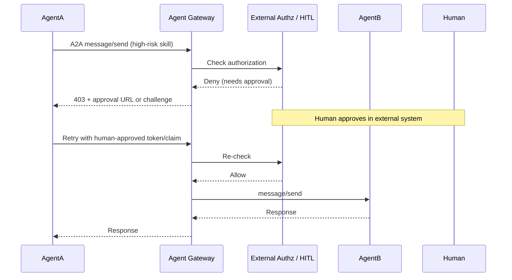

# Human-in-the-Loop for A2A

See original content in the monorepo. This is a placeholder for the standalone repo.

## Flow (Mermaid)

```mermaid
sequenceDiagram
    participant AgentA
    participant AGW as Agent Gateway
    participant Authz as External Authz / HITL
    participant AgentB

    AgentA->>AGW: A2A message/send (high-risk skill)
    AGW->>Authz: Check authorization
    Authz-->>AGW: Deny (needs approval)
    AGW-->>AgentA: 403 + approval URL or challenge
    Note over Authz,Human: Human approves in external system
    AgentA->>AGW: Retry with human-approved token/claim
    AGW->>Authz: Re-check
    Authz-->>AGW: Allow
    AGW->>AgentB: message/send
    AgentB-->>AGW: Response
    AGW-->>AgentA: Response
```
